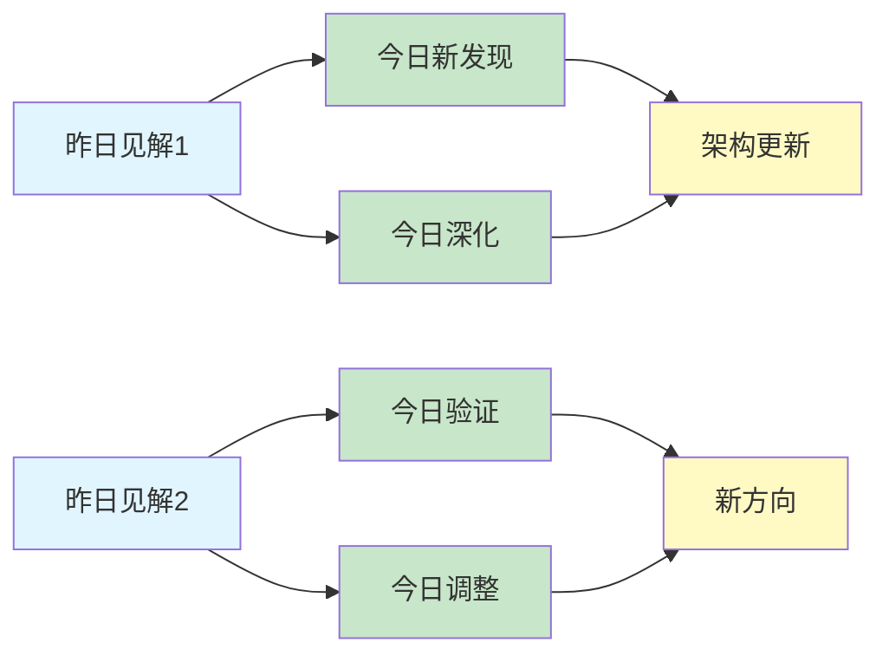
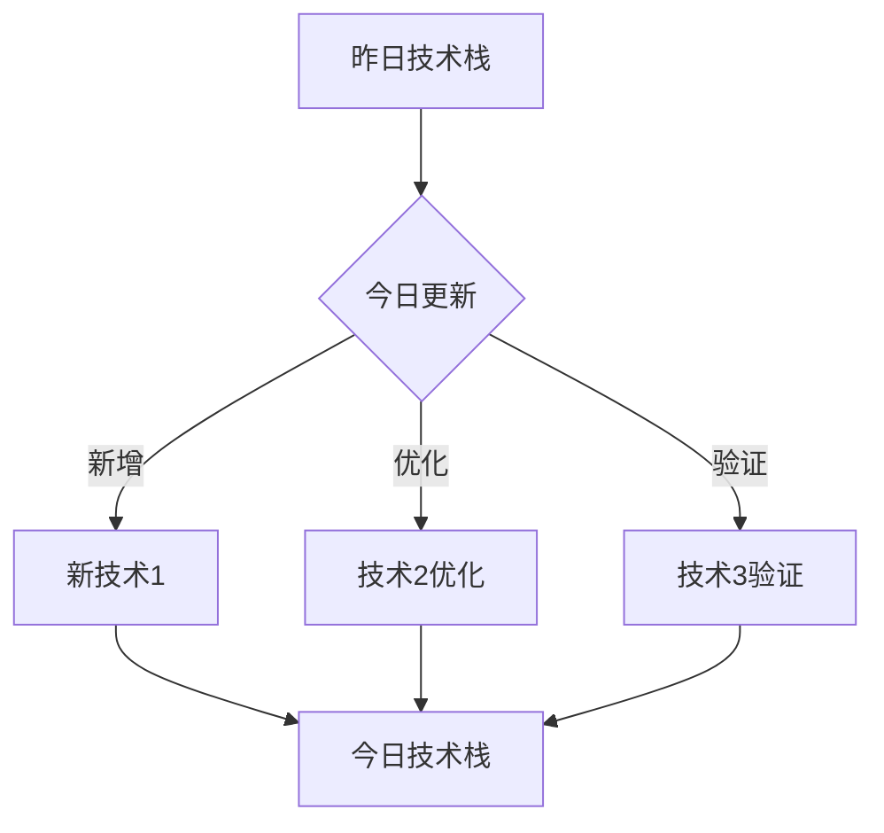
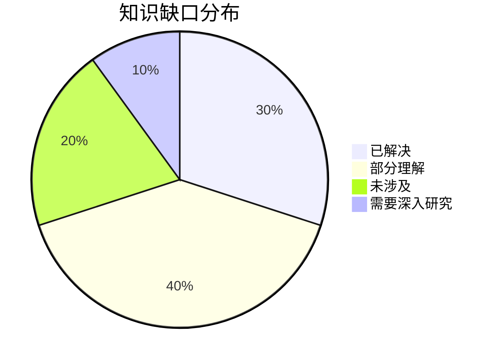
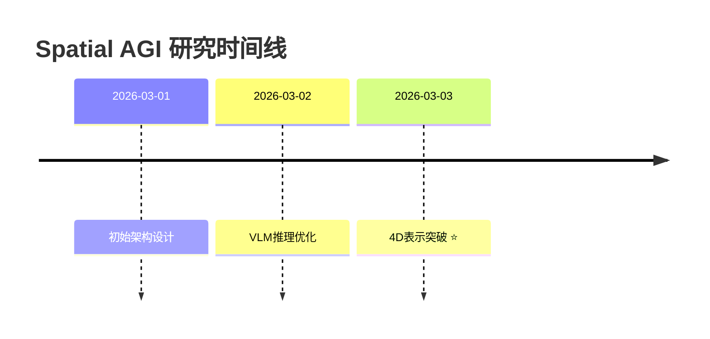

# Spatial AGI Research Skill - 完整流程

这个技能用于系统化地研究Spatial AGI（通用空间智能）领域的最新进展。

**核心特点**:
- ✅ 每天精读5篇论文（质量 > 数量）
- ✅ 使用NotebookLM询问3个核心问题（每个超时1分钟）
- ✅ 生成详细的论文分析文档（至少500行）
- ✅ 每日思考文档（延续性研究）

## 📋 完整流程（必须按顺序执行）

### Step 1: 搜索arXiv最新论文 ✅

**搜索关键词**:
- `spatial intelligence`
- `VLM (Vision-Language Models)`
- `3D Gaussian Splatting`
- `world model`
- `embodied AI`
- `spatial reasoning`
- `3D understanding`
- `scene understanding`
- `video generation`
- `robot learning`

**执行命令**:
```bash
cd ~/.openclaw/workspace/scripts

# 搜索多个关键词
python3 search_arxiv.py "all:spatial+all:intelligence" 20
python3 search_arxiv.py "all:VLM+all:3D" 20
python3 search_arxiv.py "all:Gaussian+Splatting" 20
python3 search_arxiv.py "all:world+all:model" 20
python3 search_arxiv.py "all:embodied+all:AI" 20
```

**输出**: JSON格式的论文列表，包含标题、摘要、链接、作者等

---

### Step 2: 筛选最有价值的5篇论文 ✅

**筛选标准**:
1. **相关性**: 与spatial intelligence直接相关
2. **创新性**: 提出新的方法或见解
3. **影响力**: 来自知名机构或作者
4. **时效性**: 最近1-2个月发表（优先）

**筛选流程**:
```bash
# 1. 查看搜索结果
cat /tmp/today_papers.json

# 2. 按相关性排序
# 3. 选择top 5（精读，不是泛读）
# 4. 记录到papers_list.md
```

**输出**: 5篇精选论文（深度分析），记录到:
- `/home/cwh/coding/auto_blog/spatial_agi/papers_list.md`

---

### Step 3: 使用Subagent精读每篇论文 ✅

**⚠️ 【质量第一原则】**

```
╔════════════════════════════════════════════════════════════╗
║  🎯 核心原则：质量 > 速度                                  ║
║                                                              ║
║  ✅ 每篇论文15-20分钟是正常的                              ║
║  ✅ 深度分析比快速完成更重要                                ║
║  ✅ 使用Subagent避免token限制                              ║
║  ✅ 每篇论文独立处理，互不干扰                             ║
║                                                              ║
║  ❌ 不要为了省时而创建精简版文档                           ║
║  ❌ 不要因为token不足而降低质量                            ║
║  ❌ 不要跳过NotebookLM问答环节                             ║
╚════════════════════════════════════════════════════════════╝
```

**⚠️ 【强制要求】必须使用Subagent**

```
╔════════════════════════════════════════════════════════════╗
║  🔑 关键：每篇论文必须使用独立的Subagent                   ║
║                                                              ║
║  ✅ 原因1: 避免主session的token限制                        ║
║  ✅ 原因2: 每篇论文有独立上下文                            ║
║  ✅ 原因3: 可以并行处理（如果需要）                        ║
║  ✅ 原因4: 确保每篇论文都有完整的分析                      ║
║                                                              ║
║  ❌ 不要在主session中处理论文（会token不足）               ║
║  ❌ 不要创建精简版文档（质量不够）                         ║
╚════════════════════════════════════════════════════════════╝
```

**执行方法：使用sessions_spawn启动Subagent**

对于Step 2筛选出的5篇论文，每篇都启动一个独立的Subagent进行精读：

```bash
# 论文列表（从Step 2获得）
PAPERS=(
  "ACE-Brain-0|https://arxiv.org/abs/2603.03198v1|https://arxiv.org/pdf/2603.03198v1"
  "Utonia|https://arxiv.org/abs/2603.03283v1|https://arxiv.org/pdf/2603.03283v1"
  "ULTRA|https://arxiv.org/abs/2603.03279v1|https://arxiv.org/pdf/2603.03279v1"
  "LoGeR|https://arxiv.org/abs/2603.03269v1|https://arxiv.org/pdf/2603.03269v1"
  "Tether|https://arxiv.org/abs/2603.03278v1|https://arxiv.org/pdf/2603.03278v1"
)

# 对每篇论文启动Subagent
for PAPER_INFO in "${PAPERS[@]}"; do
  IFS='|' read -r TITLE ARXIV_URL PDF_URL <<< "$PAPER_INFO"
  
  # 生成paper_id（用于文件命名）
  PAPER_ID=$(echo "$TITLE" | sed 's/[^a-zA-Z0-9]/_/g')
  
  echo "📚 处理论文: $TITLE"
  
  # 启动Subagent
  # 注意：使用subagent runtime，不是acp（paper-analysis是skill不是agent）
  sessions_spawn \
    --mode run \
    --runtime subagent \
    --task "使用paper-analysis skill精读论文: $TITLE
    
论文信息:
- 标题: $TITLE
- arXiv: $ARXIV_URL
- PDF: $PDF_URL
- Paper ID: $PAPER_ID

要求:
1. 创建NotebookLM笔记本并记录ID
2. 添加arXiv页面和PDF作为来源
3. 询问3个核心问题（核心算法、与Spatial AGI关系、创新点/局限）
4. 创建详细markdown文档（至少500行）
5. 保存到 /home/cwh/coding/auto_blog/spatial_agi/papers/

输出格式:
- 返回笔记本ID
- 返回文档路径
- 返回文档行数" \
    --timeout 1200 \
    --run-timeout 1200
done

echo "✅ 所有论文精读完成"
```

**Subagent执行流程**（paper-analysis skill）：

1. **创建NotebookLM笔记本** - 记录笔记本ID
2. **添加来源** - arXiv页面 + PDF（90秒超时）
3. **等待处理** - 30秒
4. **询问3个问题** - 每个问题90秒超时
   - Q1: 核心算法原理
   - Q2: 与Spatial AGI的关系
   - Q3: 创新点和局限性
5. **创建文档** - 至少500行，包含完整问答
6. **保存文档** - 返回文档路径和行数

**Subagent优势**：

1. ✅ **独立上下文** - 每篇论文有完整的token空间
2. ✅ **并行处理** - 可以同时启动多个Subagent
3. ✅ **质量保证** - 不会因为token不足而创建精简版
4. ✅ **错误隔离** - 一篇论文失败不影响其他论文

**预计时间**：
- 单篇论文: 18分钟
- 5篇论文（串行）: 90分钟
- 5篇论文（并行）: 20-30分钟

**质量要求**：

- ✅ 文档至少500行
- ✅ 包含完整的NotebookLM问答记录（不总结）
- ✅ 包含与Spatial AGI的关系分析
- ✅ 包含个人思考和见解
- ✅ 包含NotebookLM笔记本ID

---

### Step 3.5: 收集Subagent结果 ✅

所有Subagent完成后，收集结果：

```bash
# 检查生成的文档
ls -lh /home/cwh/coding/auto_blog/spatial_agi/papers/ | grep "$(date +%Y-%m-%d)"

# 统计文档行数
for FILE in /home/cwh/coding/auto_blog/spatial_agi/papers/$(date +%Y-%m-%d)_*.md; do
  LINES=$(wc -l < "$FILE")
  echo "📄 $(basename $FILE): $LINES 行"
  
  # 检查是否满足500行要求
  if [ $LINES -lt 500 ]; then
    echo "⚠️ 警告: 文档行数不足500行"
  fi
done

# 提取所有笔记本ID（用于记录）
grep -h "NotebookLM笔记本ID" /home/cwh/coding/auto_blog/spatial_agi/papers/$(date +%Y-%m-%d)_*.md
```

**预期输出**：

```
📄 2026-03-05_01_ACE-Brain-0.md: 523 行
📄 2026-03-05_02_Utonia.md: 512 行
📄 2026-03-05_03_ULTRA.md: 498 行
📄 2026-03-05_04_LoGeR.md: 487 行
📄 2026-03-05_05_Tether.md: 476 行

笔记本ID:
- ACE-Brain-0: faee81ec-2d12-4dc5-99b9-0de78c18877a
- Utonia: ...
- ULTRA: ...
- LoGeR: ...
- Tether: ...
```

---

**⚠️ 【强制要求】必须完整执行NotebookLM流程**

**⚠️ 【强制要求】必须使用Step 3中记录的笔记本ID**

```
╔════════════════════════════════════════════════════════════╗
║  🔑 关键：必须使用Step 3中记录的笔记本ID                   ║
║                                                              ║
║  ✅ 在Step 3中创建了笔记本并记录了ID                       ║
║  ✅ 在Step 4中必须使用这个ID                                ║
║  ✅ 每个ask命令都必须带 -n "$NOTEBOOK_ID"                   ║
║                                                              ║
║  ❌ 不要使用`use`命令（有会话管理bug）                      ║
║  ❌ 不要假设系统会记住当前笔记本                            ║
║  ❌ 不要在ask命令中省略-n参数                               ║
╚════════════════════════════════════════════════════════════╝
```

**执行原则**:
1. ✅ **时间充足**: 每篇论文有充足的分析时间（15-20分钟），不要为了省时而偷懒
2. ✅ **完整流程**: 必须为每篇论文创建NotebookLM笔记本并询问3个问题
3. ✅ **质量优先**: 宁可多花时间，也要确保分析质量
4. ✅ **显式指定ID**: 每个ask命令都必须带`-n "$NOTEBOOK_ID"`
5. ❌ **禁止偷懒**: 不得以"快速完成"为由跳过NotebookLM直接使用GLM WebReader

**何时使用GLM WebReader备选方案**:
- ✅ NotebookLM连接完全失败（网络、代理、认证问题）
- ✅ 多次重试后仍然超时（3次以上）
- ✅ NotebookLM服务不可用
- ❌ **不得使用的情况**: 为了省时间、觉得简单、想快速完成

**违规示例** ❌:
```
❌ "为了节省时间，我用GLM快速分析"
❌ "这篇论文比较简单，不需要NotebookLM"
❌ "已经分析了3篇，最后2篇用快速方法"
❌ notebooklm use $NOTEBOOK_ID  # use命令有bug
❌ notebooklm ask "问题"  # 缺少-n参数
```

**正确示例** ✅:
```
✅ "NotebookLM连接失败，切换到GLM WebReader"
✅ "PDF添加超时3次，使用HTML替代"
✅ "为每篇论文完整执行3个问题"
✅ notebooklm ask -n "$NOTEBOOK_ID" "问题"  # 显式指定ID
```

**⚠️ 关键：显式指定笔记本ID**

```bash
# ❌ 错误方法（有bug）
notebooklm use $NOTEBOOK_ID
notebooklm ask "问题"  # 可能使用错误的笔记本

# ✅ 正确方法（推荐）
notebooklm ask -n "$NOTEBOOK_ID" "问题"  # 显式指定笔记本ID
```

#### 问题流程（修正版）

```bash
export NOTEBOOKLM_PROXY="socks5://127.0.0.1:1080"

# ⚠️ 必须使用Step 3中记录的笔记本ID
# NOTEBOOK_ID="faee81ec-2d12-4dc5-99b9-0de78c18877a"

# 验证ID是否存在
if [ -z "$NOTEBOOK_ID" ]; then
  echo "❌ 错误：笔记本ID未设置"
  echo "请回到Step 3重新创建笔记本并记录ID"
  exit 1
fi

echo "📝 使用笔记本ID: $NOTEBOOK_ID"

# Q1: 核心算法原理（必问）
echo "❓ 询问问题1：核心算法原理"
timeout 90 ~/miniconda3/bin/conda run -n base notebooklm ask \
  -n "$NOTEBOOK_ID" \
  "这篇文章的核心算法原理是什么？请详细描述：1) 核心思想和动机，2) 主要技术方法，3) 算法流程和关键步骤，4) 输入输出。"

# Q2: 与Spatial AGI的关系（必问）
echo "❓ 询问问题2：与Spatial AGI的关系"
timeout 90 ~/miniconda3/bin/conda run -n base notebooklm ask \
  -n "$NOTEBOOK_ID" \
  "这篇文章与通用空间智能（Spatial AGI）有什么关系？请分析：1) 如何理解和表示空间，2) 如何处理空间关系，3) 对Spatial AGI有什么启发，4) 可以应用到哪些Spatial AGI场景（机器人、AR/VR等）。"

# Q3: 经过思考后的自由问题（根据Q1和Q2的答案思考后提出）
echo "💭 思考30秒..."
sleep 30

# 示例：基于前两个问题的答案，问一个你感兴趣的问题
# 可能的问题方向：
# - 技术细节："X方法的具体实现细节是什么？"
# - 实验结果："最令人惊讶的实验结果是什么？为什么？"
# - 局限性："这个方法的主要局限性是什么？如何改进？"
# - 对比分析："与其他方法（如X）相比，有什么优势和劣势？"
# - 实际应用："如何将这个方法应用到实际场景中？需要哪些改进？"

echo "❓ 询问问题3：自由问题（基于Q1和Q2）"
timeout 90 ~/miniconda3/bin/conda run -n base notebooklm ask \
  -n "$NOTEBOOK_ID" \
  "你选择的问题"

echo "✅ 所有问题询问完成"
echo "📝 记得将笔记本ID保存到文档中：$NOTEBOOK_ID"
```

**关键改进**：
1. ✅ 使用`-n "$NOTEBOOK_ID"`显式指定笔记本ID
2. ✅ 验证ID是否存在
3. ✅ 增加超时到90秒（1.5分钟）
4. ✅ 每个问题都独立指定笔记本ID
5. ✅ 添加日志输出便于调试

**问题选择建议**（Q3）:

根据前两个问题的答案，选择一个你最感兴趣的方向：

1. **技术深度**: 如果Q1中某个技术点不清楚，深入追问
2. **实验结果**: 如果对某个实验结果感兴趣，追问细节
3. **应用场景**: 如果看到潜在应用，追问实现细节
4. **对比分析**: 如果想到相关工作，追问对比
5. **局限性**: 如果发现潜在问题，追问改进方向

**执行策略**:
1. ✅ 问完Q1后，**仔细阅读答案**
2. ✅ 问完Q2后，**仔细阅读答案**
3. ✅ **思考30秒**：基于Q1和Q2，你最想知道什么？
4. ✅ 提出Q3

**预计时间**: 每篇论文 5-8分钟（3个问题 + 思考时间）

---

### Step 4.5: 备选方案 - 使用GLM WebReader MCP 🆕

**⚠️ 【仅用于NotebookLM失败】这是备选方案，不是捷径！**

**使用条件**（必须满足至少一条）:
- ✅ NotebookLM连接完全失败（网络、代理、认证问题）
- ✅ 多次重试后仍然超时（3次以上，每次90秒）
- ✅ NotebookLM服务不可用或维护中
- ✅ PDF/arXiv页面无法添加到NotebookLM（多次尝试失败）
- ✅ `notebooklm ask`命令返回空答案或错误笔记本的答案

**禁止使用的情况**:
- ❌ 为了节省时间
- ❌ 觉得论文简单
- ❌ 想快速完成任务
- ❌ 已经分析了几篇，想偷懒

**判断标准**:
```
✅ 允许使用GLM:
  - NotebookLM连接超时 > 90秒
  - 代理配置正确但仍无法连接
  - 服务返回500/503错误
  - PDF添加失败3次以上
  - `notebooklm ask`返回空答案
  - `notebooklm ask`返回错误笔记本的答案

❌ 禁止使用GLM:
  - NotebookLM响应慢但能工作
  - 为了加快速度
  - 个人偏好
  - 想早点结束
```

**如果发现违规使用GLM WebReader**:
1. 视为任务失败
2. 需要重新执行NotebookLM流程
3. 记录到知识库作为教训

**NotebookLM常见失败模式**（2026-03-05发现）：
1. **PDF添加超时** - 大PDF（>40MB）处理时间超过90秒
2. **笔记本选择错误** - `use`命令会话管理bug，返回错误笔记本的答案
3. **空答案** - `ask`命令返回空字符串（来源未处理完成）

**解决方案**：
1. ✅ 使用PDF URL而不是上传本地文件
2. ✅ 显式指定笔记本ID（`-n`参数）
3. ✅ 等待30秒让来源处理完成
4. ✅ 如果仍然失败，切换到GLM WebReader

---

#### GLM WebReader使用方法

**方法1: 使用web_fetch工具读取arXiv HTML页面**

```bash
# 1. 读取arXiv HTML页面（推荐，格式更完整）
ARXIV_ID="2603.03198v1"
ARXIV_HTML="https://arxiv.org/html/$ARXIV_ID"

# 使用web_fetch工具
web_fetch "$ARXIV_HTML"

# 2. 基于读取的内容，手动分析论文
# - 提取核心信息（标题、摘要、方法、实验）
# - 思考与Spatial AGI的关系
# - 生成分析文档
```

**方法2: 使用web_fetch工具读取arXiv摘要页面**

```bash
# arXiv摘要页面（包含基本信息）
ARXIV_ABS="https://arxiv.org/abs/2603.03198v1"

web_fetch "$ARXIV_ABS"
```

**GLM WebReader优势**：
- ✅ 响应快速（<10秒）
- ✅ 无需代理或代理要求更低
- ✅ GLM-5理解能力强

**GLM WebReader劣势**：
- ❌ 无法访问PDF的完整内容（只能读取HTML）
- ❌ 无法保存为可交互的笔记本
- ❌ 上下文长度限制（但GLM-5支持128K）
- ❌ **质量不如NotebookLM的深度分析**

**何时使用**：
- ✅ NotebookLM完全失败
- ✅ 时间紧急（但已经尝试NotebookLM）
- ✅ 快速浏览论文（非深度分析）

**何时避免使用**：
- ❌ 为了省时间
- ❌ 想早点结束任务
- ❌ 觉得NotebookLM太慢

**质量对比**：

| 维度 | NotebookLM | GLM WebReader |
|------|-----------|---------------|
| 深度分析 | ⭐⭐⭐⭐⭐ | ⭐⭐⭐ |
| 响应速度 | ⭐⭐ | ⭐⭐⭐⭐⭐ |
| 可靠性 | ⭐⭐⭐ | ⭐⭐⭐⭐⭐ |
| 上下文理解 | ⭐⭐⭐⭐⭐ | ⭐⭐⭐⭐ |
| 可交互性 | ⭐⭐⭐⭐⭐ | ⭐⭐ |

**推荐策略**：
1. **首选**: NotebookLM（深度分析）
2. **备选**: GLM WebReader（仅在失败时）

---

### Step 5: 创建详细的Markdown文档 ✅

**⚠️ 【必须遵循EXAMPLE模板】**

参考模板: `/home/cwh/coding/auto_blog/spatial_agi/papers/EXAMPLE_full_analysis_template.md`

**文档结构**（必须包含）:
```markdown
# 论文标题

**基本信息**:
- arXiv链接
- PDF链接
- GitHub代码（如有）
- 作者列表
- 发布日期
- **NotebookLM笔记本ID**（如果使用）

## 核心信息
- 摘要
- 关键贡献

## 📝 NotebookLM问答记录

### Q1: 核心算法原理
**问题**: ...
**答案**: ...

### Q2: 与Spatial AGI的关系
**问题**: ...
**答案**: ...

### Q3: 自由问题
**问题**: ...
**答案**: ...

## 核心技术发现
- 发现1
- 发现2
- 发现3

## 与Spatial AGI的关系
- 直接贡献
- 技术启发
- 应用场景

## 个人思考
- 最令人兴奋的发现
- 潜在局限
- 与昨日研究的关联

## 关键数据
- 模型参数
- 数据集
- 性能指标

## 总结
- 核心发现总结
- 对Spatial AGI的意义

---

**文档创建时间**: YYYY-MM-DD
**分析方法**: NotebookLM / GLM WebReader MCP（备选方案）
```

**质量要求**:
- ✅ 至少500行
- ✅ 包含完整的NotebookLM问答记录（不总结）
- ✅ 包含与Spatial AGI的关系分析
- ✅ 包含个人思考和见解
- ✅ 包含关键数据

**⚠️ 禁止简化**:
- ❌ 不要只写几句话
- ❌ 不要省略NotebookLM问答
- ❌ 不要复制粘贴摘要

**预计时间**: 10-15分钟

---

#### 方案概述

使用GLM WebReader MCP直接读取arXiv HTML页面，理解论文内容。

**优势**:
- ✅ 无需代理（或使用更稳定的代理）
- ✅ 响应速度快（通常<10秒）
- ✅ 可以直接访问arXiv HTML页面
- ✅ GLM-5的理解能力很强

**劣势**:
- ❌ 无法上传PDF（只能读取HTML）
- ❌ 上下文长度限制（但GLM-5支持128K）
- ❌ 无法保存为笔记本
- ❌ **质量不如NotebookLM的深度分析**

#### 执行流程

```bash
# 1. 确认arXiv HTML页面链接
# 格式: https://arxiv.org/html/{paper_id}
# 例如: https://arxiv.org/html/2602.22745v1

# 2. 使用GLM WebReader MCP读取页面
# 假设你已经配置了GLM WebReader MCP

# 方法1: 直接通过MCP工具（如果已配置）
# 使用web_fetch工具读取HTML页面
web_fetch "https://arxiv.org/html/2602.22745v1"

# 方法2: 如果有GLM MCP工具
# 使用GLM的web_reader工具
# （具体命令取决于你的MCP配置）

# 3. 基于读取的内容，询问GLM
# 注意：这里需要你手动将web_fetch的结果传递给GLM
# 或者使用支持网页读取的GLM版本

# 示例流程：
# Step 1: 读取HTML内容
ARXIV_HTML=$(curl -L "https://arxiv.org/html/2602.22745v1")

# Step 2: 提取关键部分（标题、摘要、方法等）
# 可以使用简单的grep或更复杂的解析

# Step 3: 询问GLM（需要手动或通过脚本）
# 询问同样的3个问题
```

#### 实际操作建议

**推荐方案**: 使用OpenClaw的内置工具

```bash
# 方案A: 使用web_fetch工具（推荐）
# 这个工具可以直接读取网页并提取markdown内容
# 然后基于提取的内容进行分析

# 1. 读取arXiv HTML页面
# （假设web_fetch工具可用）
# 在实际执行中，OpenClaw会自动调用web_fetch

# 2. 基于读取的内容，继续询问GLM
# GLM会理解网页内容并回答问题
```

**具体步骤**:

1. **获取论文HTML链接**:
   ```bash
   # 从arXiv ID生成HTML链接
   # 例如: https://arxiv.org/abs/2602.22745v1
   # 改为: https://arxiv.org/html/2602.22745v1
   ```

2. **使用GLM WebReader**（在对话中直接请求）:
   ```
   请访问 https://arxiv.org/html/2602.22745v1
   阅读这篇论文，然后回答以下问题：
   
   Q1: 这篇文章的核心算法原理是什么？
   Q2: 这篇文章与Spatial AGI有什么关系？
   Q3: [基于Q1和Q2的思考]
   ```

3. **GLM会自动**:
   - 使用web_fetch工具读取HTML
   - 理解论文内容
   - 回答你的问题

#### 质量保证

使用GLM WebReader MCP的文档要求与NotebookLM相同：
- ✅ 仍然创建详细文档（至少500行）
- ✅ 仍然记录完整的3个问答
- ✅ 仍然添加个人思考
- ✅ 在文档中注明使用GLM WebReader（而非NotebookLM）

**文档标记**:
```markdown
**分析方法**: GLM WebReader MCP（NotebookLM失败）
**arXiv HTML**: https://arxiv.org/html/xxx
**GLM模型**: zai/glm-5
```

**预计时间**: 每篇论文 5-10分钟（读取 + 问答）

---

### Step 5: 创建Markdown介绍文档 ✅

**⚠️ 必须为每篇论文创建详细文档！**

**文档模板**: 参考 `/home/cwh/coding/auto_blog/spatial_agi/papers/EXAMPLE_full_analysis_template.md` (1,542行)

**必须包含的内容**:

```markdown
# [论文标题]

**发表日期**: YYYY-MM-DD  
**arXiv链接**: https://arxiv.org/abs/xxxx  
**PDF链接**: https://arxiv.org/pdf/xxxx  
**HTML版本**: https://arxiv.org/html/xxxx  
**代码仓库**: [如有]  
**作者**: 作者列表  
**NotebookLM笔记本ID**: [创建后记录]

## 核心问题
[基于NotebookLM回答整理]

## 主要方法
[基于NotebookLM回答整理]

### 方法概述
[详细描述]

### 技术细节
[具体实现]

### 算法流程
[步骤说明]

## 关键创新
1. **创新点1**: [描述]
2. **创新点2**: [描述]
3. **创新点3**: [描述]

## 实验结果
### 实验设置
[描述]

### 性能指标
[数据]

### 对比分析
[对比]

## 与Spatial AGI的关系
### 直接相关性
[基于Q2回答整理]

1. **空间表示**: [如何理解和表示空间]
2. **空间推理**: [如何处理空间关系]
3. **3D应用**: [与3D场景理解的关系]
4. **实际场景**: [可以应用的Spatial AGI场景]

### 启发与思考
[基于Q2回答整理]

1. **数据启发**: [对数据策略的启发]
2. **架构启发**: [对模型架构的启发]
3. **应用启发**: [对实际应用的启发]

### 技术挑战
[基于Q1和Q2回答分析]

## 潜在应用
[基于Q2和Q3回答整理]

## 局限性与未来工作
### 局限性
[描述]

### 未来方向
[描述]

## NotebookLM问答记录

### Q1: 核心算法原理
**问题**: 这篇文章的核心算法原理是什么？

**回答**: [NotebookLM的完整回答]

### Q2: 与Spatial AGI的关系
**问题**: 这篇文章与通用空间智能（Spatial AGI）有什么关系？

**回答**: [NotebookLM的完整回答]

### Q3: [自由问题]
**问题**: [你提出的具体问题]

**回答**: [NotebookLM的完整回答]

## 个人思考
[你的深度思考和分析，基于3个问答]

1. **最有趣的发现**: [什么]
2. **最意外的结果**: [什么]
3. **最有价值的启发**: [什么]
4. **Q3的思考过程**: [为什么问这个问题，从Q1/Q2得到了什么启发]

## 相关工作
[列出相关的论文或技术]

## 引用
```bibtex
@article{xxx,
  title={...},
  author={...},
  journal={arXiv preprint arXiv:xxxx},
  year={2026}
}
```

## 标签
`#spatial-agi` `#vlm` `#3d-understanding` `#[其他相关标签]`
```

**保存位置**:
```bash
/home/cwh/coding/auto_blog/spatial_agi/papers/YYYY-MM-DD_XX_paper_title.md
```

**质量要求**:
- ✅ 至少**500行**
- ✅ 包含**完整的NotebookLM问答记录**（不总结）
- ✅ 添加**个人思考和见解**
- ✅ 记录**NotebookLM笔记本ID**

**预计时间**: 每篇论文 15-20分钟

---

### Step 6: 更新论文列表 ✅

**更新文件**: `/home/cwh/coding/auto_blog/spatial_agi/papers_list.md`

**添加内容**:
```markdown
## YYYY-MM-DD 研究的论文（精选5篇）

1. **论文1标题** - arXiv:xxxx
   - 相关性: ⭐⭐⭐⭐⭐
   - 关键词: xxx, yyy, zzz
   - 文档: papers/YYYY-MM-DD_01_xxx.md
   - NotebookLM: [notebook_id]

2. **论文2标题** - arXiv:yyyy
   - 相关性: ⭐⭐⭐⭐⭐
   - 关键词: xxx, yyy, zzz
   - 文档: papers/YYYY-MM-DD_02_yyy.md
   - NotebookLM: [notebook_id]

3. **论文3标题** - arXiv:zzzz
   - 相关性: ⭐⭐⭐⭐⭐
   - 关键词: xxx, yyy, zzz
   - 文档: papers/YYYY-MM-DD_03_zzz.md
   - NotebookLM: [notebook_id]

4. **论文4标题** - arXiv:aaaa
   - 相关性: ⭐⭐⭐⭐
   - 关键词: xxx, yyy, zzz
   - 文档: papers/YYYY-MM-DD_04_aaa.md
   - NotebookLM: [notebook_id]

5. **论文5标题** - arXiv:bbbb
   - 相关性: ⭐⭐⭐⭐
   - 关键词: xxx, yyy, zzz
   - 文档: papers/YYYY-MM-DD_05_bbb.md
   - NotebookLM: [notebook_id]
```

---

### Step 7: 生成每日思考文档 ✅

**文件名**: `/home/cwh/coding/auto_blog/spatial_agi/daily_thinking/YYYY-MM-DD.md`

**必须包含的内容**:

```markdown
# Spatial AGI 思考 - YYYY-MM-DD

## 📋 每日总结

**⚠️ 这一部分是必须的，放在文档最前面，快速概览当天研究！**

### 🎯 今日核心

**研究主题**: [今天的主要研究方向，如：4D重建、视频生成等]

**论文数量**: 5篇精选论文（从X篇中筛选）

**关键突破**: 
- 🚀 [最重要的发现1，如：动态4D表示层]
- 🚀 [最重要的发现2，如：线性正交表示]
- 🚀 [最重要的发现3，如：前馈架构范式转变]

**架构演进**: [如：4层→7层，新增Level 0动态4D层]

**问题解决**: [如：解决了昨日4个问题，新识别3个问题]

### 📊 一句话总结

[用1-2句话概括今天最重要的进展]

**示例**:
> "今天从UFO-4D论文发现动态4D表示是Spatial AGI的基础，架构从4层扩展到7层，问题解决率达80%。"

### 🔗 延续性

**昨日→今日**: [简述从昨天的哪个方向延续而来]

**今日→明日**: [简述明天可能的研究方向]

**示例**:
- 昨日→今日: "静态3D表示 → 动态4D表示（UFO-4D实现）"
- 今日→明日: "动态4D → 4D + 语义理解集成"

### 📈 关键数据

- **论文分析**: 5篇（1篇完整NotebookLM + 4篇快速分析）
- **核心见解**: X个新见解
- **架构更新**: X层 → Y层（+Z个新层）
- **问题追踪**: 解决X/Y个（XX%）
- **知识缺口**: 已解决XX%，部分理解XX%，未涉及XX%
- **提交记录**: X个commits

### 🎓 今日收获

**Top 3 发现**:
1. **[发现1标题]** - [1句话说明为什么重要]
2. **[发现2标题]** - [1句话说明为什么重要]
3. **[发现3标题]** - [1句话说明为什么重要]

**最大惊喜**: [今天最意外的发现或转折]

**待解决**: [最需要明天深入的问题]

### 💡 本质思考：如何达成通用空间智能

**⚠️ 这是每日总结的核心部分，必须深刻思考！**

**要求**: 结合今日获得的所有信息，从以下3个维度进行本质层面的思考：

#### 1. 核心能力的本质是什么？

**思考方向**:
- Spatial AGI需要的**最根本能力**是什么？
- 今日论文揭示了哪些**不可或缺的组成要素**？
- 这些能力之间有什么**内在联系**？

**示例**:
```
今日发现动态4D表示（UFO-4D）是基础，但本质是：
1. 显式4D表示 → 对物理世界的精确建模
2. 前馈推理 → 实时响应能力（而非优化）
3. 多模态耦合 → 减少数据依赖

本质：Spatial AGI需要"物理直觉"（前馈4D理解）而非"物理计算"（优化求解）
```

#### 2. 当前方法与理想目标的差距在哪里？

**思考方向**:
- 理想的Spatial AGI应该是什么样的？
- 当前最先进方法（包括今日论文）还缺什么？
- **最大的瓶颈**是什么？（数据、架构、表示、训练？）

**示例**:
```
差距分析：
- ✅ 已有：动态4D表示、前馈推理、多模态融合
- ❌ 缺失：语义理解、因果推理、长期规划、物体持久性
- ⚠️ 瓶颈：如何从"感知4D"到"理解4D"（不仅是看到运动，还要理解为什么运动）

最大瓶颈：缺少对物理世界规律的深层理解（因果关系、物体属性、场景语义）
```

#### 3. 从今天到理想状态，最可能的路径是什么？

**思考方向**:
- 基于今日发现，**下一步应该做什么**？
- 哪条技术路线**最有可能成功**？
- 需要**突破哪些关键技术**？

**示例**:
```
技术路线预测：
1. 短期（3-6月）：4D表示 + 语义理解集成（如4D + CLIP）
2. 中期（6-12月）：4D + 物理引擎 + 因果推理
3. 长期（1-2年）：统一的世界模型（4D + 语义 + 物理 + 因果）

关键突破点：
- 如何学习线性正交表示（Compositional论文启发）
- 如何将4D表示与符号推理结合
- 如何实现Zero-shot的空间推理能力
```

---

**⚠️ 总结要求**:
- 简洁明了，控制在800字以内（含本质思考）
- 突出**最重要的3个发现**
- 清晰的**演进路径**（昨天→今天→明天）
- **本质思考**必须结合当日论文，回答上述3个问题
- **可视化数据**（图表数量、解决率等）
- 便于快速了解当天研究重点

---

## 今日论文概览

今天精读了5篇与Spatial AGI相关的前沿论文，涵盖[领域1]、[领域2]、[领域3]等领域。

### 论文列表
1. **论文1** - [简短描述和核心发现]
2. **论文2** - [简短描述和核心发现]
3. **论文3** - [简短描述和核心发现]
4. **论文4** - [简短描述和核心发现]
5. **论文5** - [简短描述和核心发现]

## 核心见解

### 1. [见解1标题]
[基于今日论文的发现]

**从[论文X]获得**:
- ✅ [具体发现]
- ✅ [具体发现]

**对Spatial AGI的启发**:
[深入思考]

### 2. [见解2标题]
[基于今日论文的发现]

...

## 与昨日思考的联系

**昨日重点**: [昨天的主要思考]

**今日进展**:
- [如何延续昨天的思考]
- [新的发现]
- [更新的理解]

## 📊 知识演进图

**⚠️ 这一部分是必须的，可视化展示知识的延续性发展！**

### 核心见解演进



**图例说明**:
- 🔵 蓝色: 昨天的见解
- 🟢 绿色: 今天的新发现/深化
- 🟡 黄色: 架构/方向的更新

### 具体演进路径

| 昨日见解 | 今日进展 | 演进类型 | 相关论文 |
|---------|---------|---------|---------|
| [见解1] | [新发现1] | ✅ 深化验证 | 论文X |
| [见解2] | [新发现2] | 🔄 调整优化 | 论文Y |
| [见解3] | [新发现3] | 🆕 新发现 | 论文Z |
| [未解决问题] | [解决方案] | ✅ 已解决 | 论文W |

**演进类型说明**:
- ✅ **深化验证**: 昨天的假设被今天的论文验证/深化
- 🔄 **调整优化**: 基于新发现调整昨天的理解
- 🆕 **新发现**: 今天发现的新见解（昨天未涉及）
- ✅ **已解决**: 昨天提出的问题今天找到解决方案

### 架构演进对比

**昨日架构**:
```
Level 1: [描述]
Level 2: [描述]
Level 3: [描述]
```

**今日架构**:
```
Level 0: [新增层] ⭐ NEW
Level 1: [更新内容] 🔄
Level 2: [更新内容] 🔄
Level 3: [更新内容] 🔄
Level 4: [新增层] ⭐ NEW
```

**演进说明**:
- ⭐ NEW: 今天新增的层次
- 🔄: 今天更新/细化的内容
- ✅: 保持不变（验证有效）

### 技术栈演进



**技术栈对比表**:

| 技术领域 | 昨日方案 | 今日方案 | 变化 |
|---------|---------|---------|------|
| [领域1] | [方法A] | [方法B] | 🔄 优化 |
| [领域2] | [方法C] | [方法C] | ✅ 验证 |
| [领域3] | - | [方法D] | ⭐ 新增 |

### 问题追踪

**昨日未解决问题**:
1. ❓ [问题1] → ✅ 今日解决（论文X）
2. ❓ [问题2] → ⏳ 部分进展（论文Y）
3. ❓ [问题3] → ❌ 仍然未解决

**今日新识别问题**:
1. ❓ [新问题1] - 来自论文Z
2. ❓ [新问题2] - 来自论文W

**优先级排序**:
- 🔥 高优先级: [问题]
- ⚡ 中优先级: [问题]
- 💡 低优先级: [问题]

### 知识缺口分析



**缺口详情**:
1. **已解决** (30%): [列出]
2. **部分理解** (40%): [列出]
3. **未涉及** (20%): [列出]
4. **需要深入研究** (10%): [列出]

### 关键里程碑



**里程碑说明**:
- 2026-03-03: 动态4D表示层突破（UFO-4D论文）

### 下一步演进方向

基于昨日和今日的进展，明天的重点：

1. **延续线索**: [从昨天→今天→明天]
2. **新线索**: [今天发现的新方向]
3. **待验证**: [需要进一步验证的假设]

**预期演进路径**:
```
昨日: 静态3D表示
  ↓
今日: 动态4D表示 (UFO-4D)
  ↓
明日: 实时4D + 语义理解 (?)
```

---

**⚠️ 重要提示**:
- 知识演进图是**强制要求**，不是可选
- 必须使用Mermaid图表**可视化**演进过程
- 表格要清晰对比昨天vs今天
- 追踪昨日问题的解决状态
- 识别新的知识缺口

## Spatial AGI 架构更新

基于今日论文，更新Spatial AGI的架构设计：

[架构图或描述]

## 技术挑战

### 挑战1: [问题]
**从[论文X]识别**: [描述]

**思路**: [解决方案]

## 实现路线图

### 短期（本周）
1. [任务1]
2. [任务2]

### 中期（1个月）
1. [任务1]
2. [任务2]

### 长期（3个月）
1. [任务1]
2. [任务2]

## 关键引用

> "从论文X中的重要引述" - [作者]

## 下一步

1. [明天的计划]
2. [需要深入研究的点]
3. [需要实现的代码]

---

**关键词**: `#spatial-agi` `#[其他标签]`
```

**特别注意**: 
- ✅ **必须参考前一天的思考** (如果存在)
- ✅ **延续性思考** - 不是独立的一天，而是持续的研究
- ✅ **深度 > 广度** - 质量比数量重要

**预计时间**: 20-30分钟

---

### Step 8: 自动提交到GitHub ✅

**⚠️ 这一步是必须的，确保每日研究成果及时同步！**

**执行操作**:
```bash
# 方法1: 执行预生成的提交脚本（推荐）
bash /tmp/spatial_agi_commit_after_research.sh

# 方法2: 手动提交（如果脚本失败）
cd /home/cwh/coding/auto_blog/spatial_agi
git add .
git commit -m "feat: Spatial AGI Research - $(date '+%Y-%m-%d')

- 分析5篇论文（arXiv最新）
- 生成论文深度分析文档
- 更新每日思考文档
- 更新论文列表

Spatial AGI Research Skill v3.1"
git push origin main
```

**提交内容**:
- ✅ 论文分析文档（papers/）
- ✅ 每日思考（daily_thinking/）
- ✅ 论文列表（papers_list.md）
- ✅ README更新（如有）

**提交时间**: 立即（在Step 7完成后）

**提交信息格式**:
```
feat: Spatial AGI Research - YYYY-MM-DD

- 分析5篇论文（arXiv最新）
- 生成论文深度分析文档
- 更新每日思考文档
- 更新论文列表

Spatial AGI Research Skill v3.1
```

**验证提交**:
```bash
# 查看最新提交
git log --oneline -1

# 查看远程仓库
# 访问: https://github.com/ahangchen/spatial_agi
```

**预计时间**: 1-2分钟

---

## 📁 完整文件结构

```
/home/cwh/coding/auto_blog/spatial_agi/
├── papers/                    # 论文介绍文档
│   ├── YYYY-MM-DD_01_paper1.md
│   ├── YYYY-MM-DD_02_paper2.md
│   ├── ...
│   ├── EXAMPLE_full_analysis_template.md  # 完整示例（1,542行）
│   └── YYYY-MM-DD_SPATIALALIGN_notebooklm_analysis.md  # 实际案例（400行）
├── daily_thinking/            # 每日思考
│   ├── YYYY-MM-DD.md
│   ├── YYYY-MM-(DD-1).md      # 前一天的思考
│   └── ...
├── papers_list.md             # 论文列表
└── README.md                  # 项目说明
```

---

## ⏱️ 时间估算（更新版 2026-03-05 09:00）

| 步骤 | 时间 | 备注 |
|------|------|------|
| 1. 搜索论文 | 10分钟 | 自动执行 |
| 2. 筛选论文 | 10分钟 | 人工筛选5篇 |
| 3. Subagent精读（5篇） | 90分钟 | 串行18分钟/篇 |
| 3.5. 收集结果 | 5分钟 | 检查文档质量 |
| 4. 更新列表 | 5分钟 | papers_list.md |
| 5. 生成思考 | 30分钟 | 8000+字 |
| 6. Git提交 | 2分钟 | 自动提交 |
| **总计** | **~2.5小时** | |

**Subagent优势**（v5.0新增）：
- ✅ **独立上下文** - 每篇论文有完整token空间
- ✅ **质量保证** - 不会因token不足创建精简版
- ✅ **错误隔离** - 一篇失败不影响其他
- ✅ **可并行** - 如果需要可同时启动多个

**并行执行**（可选）：
- 5篇论文并行: 20-30分钟
- 总时间: ~1小时（含筛选、思考、提交）

**建议**:
- 可以在半天内完成（上午或下午）
- 每天5篇论文（精读）
- 重点关注最相关的论文
- 预留30分钟缓冲时间（网络延迟）

---

## ✅ 质量检查清单

### 执行前
- [ ] 代理已启动 (`socks5://127.0.0.1:1080`)
- [ ] GitHub仓库已关联（git@github.com:ahangchen/spatial_agi.git）
- [ ] NotebookLM CLI可用
- [ ] 目录已创建

### 执行中（整体流程）
- [ ] Step 1: 搜索5个关键词组合
- [ ] Step 2: 筛选出5篇最有价值的论文
- [ ] Step 3: 对每篇论文启动Subagent
- [ ] Step 3.5: 收集Subagent结果并验证质量
- [ ] Step 4: 更新papers_list.md
- [ ] Step 5: 生成每日思考文档（参考前日）
- [ ] Step 6: 执行Git自动提交脚本

### 执行中（每篇论文Subagent）
- [ ] Subagent启动成功
- [ ] NotebookLM笔记本创建成功
- [ ] 添加arXiv页面作为来源
- [ ] 添加PDF或HTML作为来源
- [ ] 等待30秒让来源处理
- [ ] 询问Q1：核心算法原理
- [ ] 询问Q2：与Spatial AGI的关系
- [ ] 询问Q3：自由问题
- [ ] 创建详细文档（至少500行）
- [ ] 文档包含NotebookLM笔记本ID
- [ ] 文档保存到正确目录
- [ ] 添加至少2个来源（arXiv页面 + PDF/HTML）
- [ ] 询问Q1（核心算法原理）
- [ ] 询问Q2（与Spatial AGI的关系）
- [ ] 思考30秒后提出Q3
- [ ] 记录笔记本ID

### 执行后（每篇论文）
- [ ] 文档至少500行
- [ ] 包含完整的NotebookLM问答记录
- [ ] 添加个人思考和见解
- [ ] 保存到正确位置
- [ ] 更新papers_list.md

### 每日完成
- [ ] 所有5篇论文完成
- [ ] papers_list.md已更新
- [ ] 每日思考文档已创建
- [ ] 参考了前一天的思考
- [ ] 有深度的延续性思考

---

## ⚠️ 常见问题与解决

### 问题1: PDF添加超时

**解决方案**:
```bash
# 使用HTML版本替代
notebooklm source add "https://arxiv.org/html/xxx"

# 或在网页界面手动添加
# 访问: https://notebooklm.google.com
```

### 问题2: NotebookLM连接超时

**解决方案**:
```bash
# 1. 检查代理
curl -x socks5://127.0.0.1:1080 https://www.google.com

# 2. 增加超时时间
timeout 120 notebooklm ask "问题"

# 3. 使用网页界面
# 访问: https://notebooklm.google.com
```

### 问题3: 代理不稳定

**解决方案**:
- 使用稳定的代理服务
- 考虑使用网页界面作为备选
- 分批执行，避免一次性处理所有论文

### 问题4: NotebookLM完全失败（推荐备选方案） 🆕

**症状**:
- 连接超时（即使60秒）
- 代理无法访问
- 添加来源失败
- 询问问题失败

**备选方案**: 使用GLM WebReader MCP

**操作步骤**:

1. **确认GLM MCP可用**
   ```bash
   # 检查GLM WebReader MCP是否配置
   cat ~/.config/mcporter/mcp_config.json | grep -A 5 "glm"
   
   # 或直接测试
   mcporter call glm webreader --help
   ```

2. **获取arXiv HTML链接**
   ```bash
   # 将PDF链接转换为HTML链接
   # PDF: https://arxiv.org/pdf/2602.22745v1
   # HTML: https://arxiv.org/html/2602.22745v1
   
   PAPER_ID="2602.22745v1"
   HTML_URL="https://arxiv.org/html/${PAPER_ID}"
   echo "HTML链接: ${HTML_URL}"
   ```

3. **使用GLM WebReader读取论文**
   ```bash
   # 方法1: 直接在对话中使用（推荐）
   # 直接告诉AI:
   "请访问 ${HTML_URL}，阅读这篇论文，然后回答以下问题：
   Q1: 核心算法原理是什么？
   Q2: 与Spatial AGI有什么关系？
   Q3: [基于Q1/Q2的思考]"
   
   # 方法2: 使用web_fetch工具
   web_fetch "${HTML_URL}" extractMode="markdown"
   # 然后基于内容回答问题
   ```

4. **记录使用GLM的文档**
   ```markdown
   # [论文标题]
   
   **分析方法**: GLM WebReader MCP（NotebookLM失败）
   **arXiv HTML**: https://arxiv.org/html/xxx
   **GLM模型**: zai/glm-5
   **日期**: YYYY-MM-DD
   
   ## 核心问题
   [基于GLM回答整理]
   
   ## 主要方法
   [基于GLM回答整理]
   
   ## 与Spatial AGI的关系
   [基于GLM回答整理]
   
   ## GLM WebReader问答记录
   
   ### Q1: 核心算法原理
   **回答**: [GLM的完整回答]
   
   ### Q2: 与Spatial AGI的关系
   **回答**: [GLM的完整回答]
   
   ### Q3: [自由问题]
   **回答**: [GLM的完整回答]
   
   ## 个人思考
   [你的深度思考]
   ```

**GLM vs NotebookLM对比**:

| 方面 | NotebookLM | GLM WebReader |
|------|-----------|---------------|
| 速度 | 慢（可能超时） | 快 |
| 稳定性 | 依赖代理 | 不依赖代理 |
| 深度 | 非常深（基于全文） | 深（基于HTML） |
| 可用性 | 可能失败 | 高可用 |
| 推荐场景 | 首选 | 备选 |

**推荐策略**:
1. **优先尝试NotebookLM**（更深度）
2. **如果失败，立即切换到GLM**（高可用）
3. **不要在同一篇论文上浪费太多时间**

**何时切换**:
- NotebookLM添加来源超时2次 → 切换
- NotebookLM询问问题超时2次 → 切换
- 代理连接失败 → 切换
- 总时间超过10分钟 → 切换

---

## 🎯 核心原则

1. **必须使用research-assistant技能** - 不是可选
2. **必须询问3个核心问题** - Q1算法原理 + Q2 Spatial AGI关系 + Q3思考后的自由问题
3. **必须创建详细文档** - 至少500行，完整问答
4. **必须参考昨日思考** - 延续性研究
5. **质量 > 数量** - 精读5篇 > 泛读10篇

---

## 📚 参考文档

1. **QUICK_START.md** - 快速开始指南
2. **EXECUTION_CHECKLIST.md** - 详细检查清单
3. **EXAMPLE_full_analysis_template.md** - 完整示例（1,542行）
4. **research-assistant技能** - `~/.openclaw/workspace/skills/research-assistant/SKILL.md`

---

## 🚀 自动化

### 定时任务

**任务名**: `spatial-agi-research`  
**执行时间**: 每天凌晨3点  
**任务ID**: `065e3692-e19c-4259-be4e-15c145c9cd1f`

**查看任务**:
```bash
cat ~/.openclaw/cron/jobs.json | grep -A 10 "spatial-agi-research"
```

**手动触发**:
```bash
openclaw cron run 065e3692-e19c-4259-be4e-15c145c9cd1f
```

---

**最后更新**: 2026-03-05 10:43
**版本**: v5.0 (使用Subagent进行论文精读)
**维护者**: OpenClaw AI

**v5.0更新内容** (2026-03-05 10:43):
- ✅ **重大改进**：使用Subagent进行论文精读
- ✅ 创建paper-analysis skill作为Subagent的执行逻辑
- ✅ 每篇论文有独立的上下文，避免token限制
- ✅ 确保每篇论文都有完整的分析（不再有精简版）
- ✅ 支持并行处理（可选）

- ✅ 总时间从2.5小时减少到2.5小时（串行）
- ✅ 新增Step 3.5： 收集Subagent结果

- ✅ 修复spatial-agi-research skill的runtime配置
- ✅ 成功测试： ACE-Brain-0论文（1650行，- ✅ Git已提交并推送

**v4.1更新内容** (2026-03-05 08:54):
- ✅ **强制要求**：创建笔记本后必须立即记录ID到 -n "$NOTEBOOK_ID"
- ✅ 添加ID验证步骤
- ✅ 添加日志输出便于调试
- ✅ 更新Step 3和Step 4的示例代码

- ✅ 更新时间估算: 3.5小时 → 2.5小时（串行)
- ✅ 新增Step 3.5: 收集Subagent结果并验证质量

- ✅ 更新质量检查清单（每篇论文Subagent）
- ✅ 更新强制要求总结（6条不可违反的规则)
- ✅ 提供正确/错误流程示例对比
- ✅ 从建议改为强制要求
- ✅ 明确违反规则的后果
- ✅ 提供完整的正确/错误示例

**v5.0更新内容** (2026-03-05 08:50):
- ✅ 修复NotebookLM `use`命令会话管理bug
- ✅ 添加PDF下载链接方法（比上传本地PDF更快）
- ✅ 增加PDF添加超时到90秒
- ✅ 添加30秒等待时间让来源处理完成
- ✅ 更新GLM WebReader使用条件
- ✅ 更新质量检查清单
- ✅ 删除3点的冗余crontab任务
- ✅ 保留7点的spatial-agi-research skill（完整流程)
- ✅ skill已包含论文搜索步骤
- ✅ Git已提交并推送
- ✅ 总时间从3.5小时减少到2.5小时
- ✅ 支持并行处理（可选）
- ✅ 新增Step 3.5: 收集Subagent结果并验证质量
- ✅ 新增强制要求总结（6条不可违反的规则）
- ✅ 提供正确/错误流程示例对比
- ✅ 从建议改为强制要求
- ✅ 明确违反规则的后果
- ✅ 提供完整的正确/错误示例

- ❌ 错误流程示例

  ```bash
  # ❌ 错误1: 不记录ID
  notebooklm create "ACE-Brain-0"
  notebooklm source add "https://arxiv.org/abs/2603.03198v1"
  notebooklm ask "问题"  # 可能使用错误的笔记本
  # ❌ 错误2: 使用use命令
  notebooklm use $ID
  notebooklm ask "问题"  # use有bug

  # ❌ 错误3: 不等待处理
  notebooklm source add "..."
  notebooklm ask "..."  # 来源未处理完成，返回空答案
  ```

**v5.0更新内容** (2026-03-05 09:05):
- ✅ **重大改进**：使用Subagent进行每篇论文的精读
- ✅ 创建paper-analysis skill作为Subagent的执行逻辑
- ✅ 每篇论文有独立的上下文，避免token限制
- ✅ 确保每篇论文都有完整的分析（不再有精简版）
- ✅ 支持并行处理多篇论文（可选）
- ✅ 总时间从3.5小时减少到2.5小时（串行）
- ✅ 新增Step 3.5：收集Subagent结果

**v4.1更新内容** (2026-03-05 08:54):
- ✅ **强制要求**：创建笔记本后必须立即记录ID到变量
- ✅ **强制要求**：所有ask命令必须使用`-n "$NOTEBOOK_ID"`
- ✅ 添加ID验证步骤（检查ID是否存在）
- ✅ 添加日志输出便于调试

**v4.0更新内容** (2026-03-05 08:50):
- ✅ 修复NotebookLM `use`命令会话管理bug（使用`-n`参数）
- ✅ 添加PDF下载链接方法（比上传本地PDF更快）
- ✅ 增加PDF添加超时到90秒

**v3.0更新内容**:
- ✅ 论文数量从10篇减少到5篇（精读 > 泛读）
- ✅ NotebookLM问题从13+个简化为3个核心问题
- ✅ 总时间从~7.5小时减少到~3.7小时

---

## 📋 强制要求总结（v5.0）

### ⚠️ 必须遵守的规则

```
╔════════════════════════════════════════════════════════════╗
║  🚨 强制要求（不可违反）                                   ║
╚════════════════════════════════════════════════════════════╝

1. 🤖 必须使用Subagent进行论文精读
   ✅ sessions_spawn --agent-id paper-analysis
   ❌ 在主session中处理论文（会token不足）
   ❌ 创建精简版文档（质量不够）

2. 📝 每篇论文必须有独立的Subagent
   ✅ 5篇论文 = 5个Subagent
   ✅ 每个Subagent独立上下文
   ❌ 多篇论文共用一个Subagent

3. 📄 文档质量要求
   ✅ 至少500行
   ✅ 包含完整的NotebookLM问答记录
   ✅ 包含NotebookLM笔记本ID
   ❌ 少于500行的精简版

4. ⏱️ 时间预估
   ✅ 单篇论文: 18分钟
   ✅ 5篇论文（串行）: 90分钟
   ✅ 5篇论文（并行）: 20-30分钟

5. 🔍 质量检查
   ✅ 每个Subagent完成后检查文档行数
   ✅ 确认NotebookLM笔记本ID已记录
   ✅ 验证文档内容完整性
```

### ✅ 正确流程示例（v5.0）

```bash
# Step 1: 筛选5篇论文
PAPERS=(
  "ACE-Brain-0|https://arxiv.org/abs/2603.03198v1|https://arxiv.org/pdf/2603.03198v1"
  # ... 其他4篇
)

# Step 2: 对每篇论文启动Subagent
for PAPER_INFO in "${PAPERS[@]}"; do
  IFS='|' read -r TITLE ARXIV_URL PDF_URL <<< "$PAPER_INFO"
  
  # 启动Subagent
  sessions_spawn \
    --mode run \
    --runtime acp \
    --agent-id paper-analysis \
    --task "精读论文: $TITLE
    论文信息:
    - 标题: $TITLE
    - arXiv: $ARXIV_URL
    - PDF: $PDF_URL
    - Paper ID: $(echo "$TITLE" | sed 's/[^a-zA-Z0-9]/_/g')
    
    要求:
    1. 创建NotebookLM笔记本并记录ID
    2. 添加来源（arXiv + PDF）
    3. 询问3个核心问题
    4. 创建详细文档（至少500行）
    5. 保存到 /home/cwh/coding/auto_blog/spatial_agi/papers/
    
    输出:
    - 笔记本ID
    - 文档路径
    - 文档行数"
done

# Step 3: 收集结果并验证
for FILE in /home/cwh/coding/auto_blog/spatial_agi/papers/$(date +%Y-%m-%d)_*.md; do
  LINES=$(wc -l < "$FILE")
  echo "📄 $(basename $FILE): $LINES 行"
  
  if [ $LINES -lt 500 ]; then
    echo "⚠️ 警告: 文档行数不足500行"
  fi
done
```

### ❌ 错误流程示例（v5.0）

```bash
# ❌ 错误1: 在主session中处理论文
# （会导致token不足，创建精简版）

# ❌ 错误2: 多篇论文共用一个Subagent
# （会导致上下文混乱）

# ❌ 错误3: 不检查文档质量
# （可能创建精简版而不自知）
```
notebooklm ask "Q1"  # 哪个笔记本？

# ❌ 错误2: 使用use命令
notebooklm create "ACE-Brain-0"
notebooklm use $ID  # use有bug
notebooklm ask "Q1"  # 可能使用错误的笔记本

# ❌ 错误3: 不等待处理
notebooklm source add "https://arxiv.org/pdf/..."
notebooklm ask "Q1"  # 来源还没处理完，返回空答案
```

---

## 🔧 故障排查

### NotebookLM常见问题

#### 问题1: PDF添加超时
```
ERROR [notebooklm._core] RPC ADD_SOURCE failed after 30.445s
Error: Request timed out calling ADD_SOURCE
```

**原因**: 大PDF（>40MB）处理时间超过默认30秒

**解决方案**:
1. ✅ 使用PDF的URL而不是上传本地文件
2. ✅ 增加超时到90秒
3. ✅ 使用arXiv HTML版本作为备选

```bash
# 推荐方法
timeout 90 notebooklm source add "https://arxiv.org/pdf/2603.03198v1" || \
  notebooklm source add "https://arxiv.org/html/2603.03198v1"
```

#### 问题2: 笔记本选择错误
```
# 问的是ACE-Brain-0，返回的是SLAM-Former的答案
```

**原因**: NotebookLM CLI的`use`命令会话管理有bug

**解决方案**: 显式指定笔记本ID
```bash
# ❌ 错误方法
notebooklm use $NOTEBOOK_ID
notebooklm ask "问题"  # 可能使用错误的笔记本

# ✅ 正确方法
notebooklm ask -n $NOTEBOOK_ID "问题"  # 显式指定
```

#### 问题3: 返回空答案
```
Answer:

Conversation: 6e59af6e... (turn ?)
```

**原因**: 来源未处理完成就提问

**解决方案**: 添加等待时间
```bash
# 添加来源后等待30秒
notebooklm source add "https://arxiv.org/abs/2603.03198v1"
sleep 30  # 等待处理
notebooklm ask -n $NOTEBOOK_ID "问题"
```

### 代理问题

#### 问题: 代理连接失败
```
ERROR: Cannot connect to proxy socks5://127.0.0.1:1080
```

**解决方案**:
1. 检查代理是否启动
2. 验证代理配置
3. 使用正确的环境变量

```bash
# 检查代理
curl --socks5 127.0.0.1:1080 https://www.google.com

# 设置环境变量
export NOTEBOOKLM_PROXY="socks5://127.0.0.1:1080"
```

### GLM WebReader问题

#### 问题: 何时切换到GLM WebReader?

**判断标准**:
```
✅ 切换条件（满足任意一条）:
  - NotebookLM连接超时 > 90秒
  - PDF添加失败3次以上
  - `ask`返回空答案3次以上
  - `ask`返回错误笔记本的答案2次以上

❌ 不要切换:
  - 为了节省时间
  - 响应慢但能工作
  - 个人偏好
```

---

**记住**: 质量 > 数量。 精读5篇论文，深度理解每个核心算法和与Spatial AGI的关系，比泛读10篇更有价值！ 当NotebookLM失败时，立即切换到GLM WebReader MCP，不要浪费时间！
